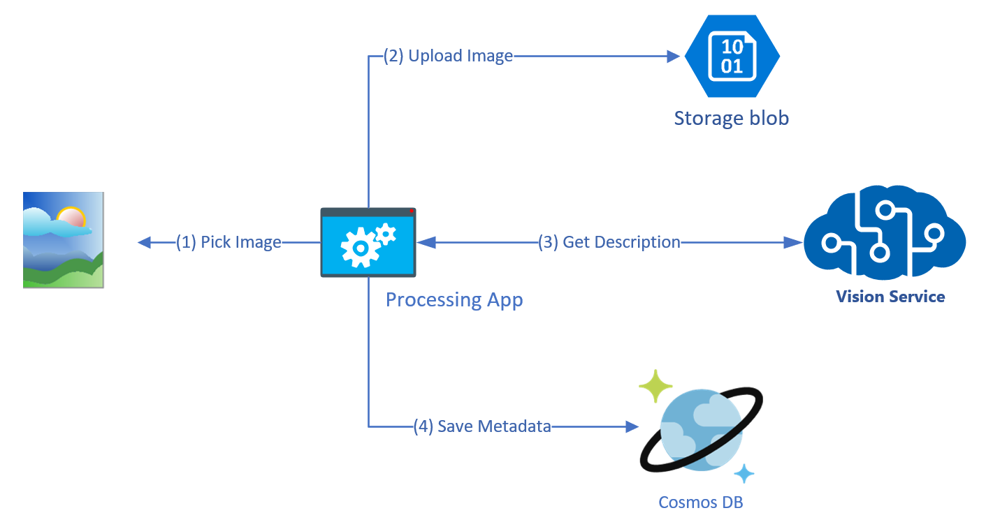
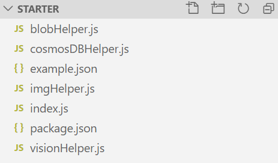
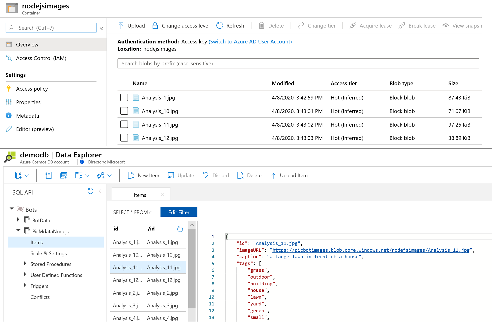

# Lab 2 - Implement Computer Vision

## Introduction

We're going to build an end-to-end application that allows you to pull in your own pictures, use Cognitive Services to obtain a caption and some tags about the images. In later labs, we will build a Bot Framework bot using LUIS to allow easy, targeted querying of such images.

## Lab 2.0: Objectives

In this lab, you will:

- Learn about the various Cognitive Services APIs
- Understand how to configure your apps to call Cognitive Services
- Build an application that calls various Cognitive Services APIs (specifically Computer Vision) in .NET applications

While there is a focus on Cognitive Services, you will also leverage Visual Studio 2019.

> **Note** if you have not already, follow the directions for creating your Azure account, Cognitive Services, and getting your api keys in [Lab1-Technical_Requirements](../Lab01/README.md).

## Lab 2.1: Architecture

We will build a simple C# application that allows you to ingest pictures from your local drive, then invoke the [Computer Vision API](https://www.microsoft.com/cognitive-services/en-us/computer-vision-api) to analyze the images and obtain tags and a description.

In the continuation of this lab throughout the course, we'll show you how to query your data, and then build a [Bot Framework](https://dev.botframework.com/) bot to query it. Finally, we'll extend this bot with [LUIS](https://www.microsoft.com/cognitive-services/en-us/language-understanding-intelligent-service-luis) to automatically derive intent from your queries and use those to direct your searches intelligently.



## Lab 2.2: Resources

There are some directories in the [main](./Lab02) github repo folder:

- **sample_images**: Some sample images to use in testing your implementation of Cognitive Services.

- **code**: In here, there are two directories. Each folder contains a solution (.sln) that has several different projects for the lab.

  - **Starter**: A starter project, which you should use if you are going through the labs

  - **Finished**: A finished project if you get stuck or run out of time.

## Lab 2.3: Image Processing

### Cognitive Services

Cognitive Services can be used to infuse your apps, websites and bots with algorithms to see, hear, speak, understand, and interpret your user needs through natural methods of communication.

There are five main categories for the available Cognitive Services:

- **Vision**: Image-processing algorithms to identify, caption and moderate your pictures
- **Knowledge**: Map complex information and data in order to solve tasks such as intelligent recommendations and semantic search
- **Language**: Allow your apps to process natural language with pre-built scripts, evaluate sentiment and learn how to recognize what users want
- **Speech**: Convert spoken audio into text, use voice for verification, or add speaker recognition to your app
- **Search**: Add Bing Search APIs to your apps and harness the ability to comb billions of webpages, images, videos, and news with a single API call

You can browse all of the specific APIs in the [Services Directory](https://azure.microsoft.com/en-us/services/cognitive-services/directory/).

Let's talk about how we're going to call Cognitive Services in our application.

### Image Processing Library

1. From VS Code Open the **code/Starter/** folder

Within the folder find the `Index.js` file. It serves as a wrapper around several services. This specific PCL contains some helper classes for accessing the Computer Vision API and an "ImageInsights" class to encapsulate the results. Later, we'll create an image processor class that will be responsible for wrapping an image and exposing several methods and properties that act as a bridge to the Cognitive Services.




**Service Helpers**

Service helpers can be used to make your life easier when you're developing your app. One of the key things that service helpers do is provide the ability to detect when the API calls return a call-rate-exceeded error and automatically retry the call (after some delay). They also help with bringing in methods, handling exceptions, and handling the keys.


**The "ImageInsights" class**

1. In the project, navigate to the **visionHelper.js** file.

You can see that there are properties for `caption` and `tags` from the images, as well as a unique `id`. "ImageInsights" collects  the information from the Computer Vision API.

Now let's take a step back for a minute. It isn't quite as simple as creating the "ImageInsights" class and copying over some methods/error handling from service helpers. We still have to call the API and process the images somewhere. For the purpose of this lab, we are going to walk through creating `index.js`, but in future projects, feel free to add this class to your PCL and start from there (it will need modification depending what Cognitive Services you are calling and what you are processing - images, text, voice, etc.).

## Lab 2.4: Creating `index.js`

1. Navigate to **index.js** within folder.

1. Locate function `main()` in the bottom of the file.

1. In **index.js** we will start by creating a content for method `main` we will use to process the image. Paste the following code within the `main` function (between the `{ }`):

```js
var args = process.argv.slice(2);

switch (args[0]) {}
```

1. If Visual Studio does not add it for you automatically, add a curly brace to the end of the file to close the method.

In the above code, we use `switch` because we want to make sure we can process the image multiple times (once for each service that needs it) by calling `-process` , so we have a function that can hand us back a way to get the files to process. Lest add following code between switch braces.

```js
  case '-process':
            var dir = path.resolve(args[1]);
            fs.access(dir, fs.F_OK, (err) => {
                if (err) {
                    console.error("The PATH must exiting folder with images!");
                    return process.exit();
                }
            });
            ProcessImages(dir)
            break;
```
In the code above we going to check the folder provided as parameter and pass this function `ProcessImages`. Further lets create new function above `main()` named `ProcessImages` by providing following code:

```js
async function ProcessImages(path) {

    await BlobHelper.InitAsync(BlobConnectionString, BlobContainerName);
    await CosmosDBHelper.InitAsync(CosmosDBEndpointUri, CosmosDBAccessKey, CosmosDBDatabaseName, CosmosDBCollectionName)

    var filter = "\\.(jpeg)|(jpg)|(png)|(bmp)";
    fs.readdir(path, async function(err, items) {
        if (typeof items == "undefined") { console.log("no files found");return;}
        for (let i = 0; i < items.length; i++) {
          //process files
        }
    }
}
```

1. Lets take a clos look to the code you just have pasted. In top of the `ProcessImages` function we have Initializers for Azure Blob and Cosmos DB. Later you know who to set up connection string for those storages. Under instillers we have a `readdir` command to get all files the folder and then start iterate by each file to process file inside of the `for`

1. Next task is update the main `for` loop and bring main logic responsible for resize images, upload images in the blob store, analyze image and store in database description. Here is code for it. Replace it under the comment `//process files`

```js
   if (items[i].toLowerCase().match(filter)) {
      var file = path + '/' + items[i];
        await ImgHelper.ResizeIfRequired(file, 750)
           .then(img => BlobHelper.UploadImage(img.src, file))
           .then(link => RunAnalyzing(subscriptionKey, endpoint, link))
           .then(info => CosmosDBHelper.UpdateDocument(info))
        console.log(`done with ${items[i]}`);
   }
```

1.Lets take a look what we just added. Each file satisfied to the filter will be resized by command `ResizeIfRequired` from file **imgHelper.js**. Took a few minutes to observe the file **imgHelper.js** with `ResizeIfRequired` function.

1. Next function is `RunAnalyzing` this is just wrapper to manage throttling of the requests to the Cognitive Services. If the service build on Free tier it will accept only 20 images for analyze in one minute. So the code will keep wait for 1 minute to reschedule request. The function is implemented in **index.js** above to the `main()`.

1. Next call is to `UpdateDocument` from **cosmosDBHelper.js** which is responsible for store analyzing data in Cosmos DB.

### Exploring Cosmos DB	

1. Azure Cosmos DB is Microsoft's resilient NoSQL PaaS solution and is incredibly useful for storing loosely structured data like we have with our image metadata results. There are other possible choices (Azure Table Storage, SQL Server), but Cosmos DB gives us the flexibility to evolve our schema freely (like adding data for new services), query it easily, and can be quickly integrated into Azure Cognitive Search (which we'll do in a later lab).	

## Lab 2.5: Understanding Blob Helper	

1. Take a few minutes to observe the **blobHelper.js** file. There are 3 function provided in helper. `InitAsync` function to initialize blob client by providing a connection string in constructor and then creating container with public access to the blobs. `UploadToBlob` function to upload file in Azure Storage Account. `UploadImage` function return URL link to the uploaded file. Notice the library [azure-storage](https://github.com/Azure/azure-storage-node) used for manipulation files in Azure Storage Account.

## Lab 2.6: Understanding CosmosDB Helper	

1. Take a few minutes to observe the **cosmosDBHelper.js** file. There are 3 function provided in helper. `InitAsync` function to initialize Cosmos DB client by providing endpoint and connection key in constructor and then creating container and database with predefined name and performance. `UpdateDocument` function to submit JSON document in Cosmos DB. `QueryDB` function to execute and fetch JSON documents from Cosmos DB. Notice the library [@azure/cosmos](https://github.com/Azure/azure-cosmos-dotnet-v3) from SDK used for manipulation JSON documents in Azure Cosmos DB.

## Lab 2.7: Understanding CosmosDB Helper	

1. Next step is finishing `main()` method from **index.js** with providing ability to query Cosmos DB. Locate `switch` in method `main()` and add additional option under the `break` 

```js
   case '-query':
            if (!args[1].match("select")) {
                console.log("The QUERY must start from 'select'!");
                return process.exit();
            }
      RunQuery(args[1]);
      break;
```

1. The code you copy previously will process queries to the cosmos DB starred from `select` and execute function `RunQuery` located above the method main. The method include initialization of the Cosmos DB Helper and retrieving result of query.

1. The last configuration parameter should provide help of use the applicaiton if no parameters was passed in function. Lets add one more parameter in `switch` located in method `main()` after the `break`:

```js
     default:
        PrintHelp();

```

1. this siple code will print out output with examples an explanation of available parameters. 

1. Now time to check your application but before from command line of VS Code type following command to restore packages:

**npm install**

You should get output similar to following. 


## Lab 2.8: Configuration

1. From **index.js** locate in top of the files following variables. Its need to be updated within your environment values: 

```js
const subscriptionKey = "your vision cognitive service key"; 
const endpoint = "your vision cognitive service endpoint url FQDN with https"
const BlobConnectionString = "Connection string form your Storage Account"
const BlobContainerName = "lowercase and number name of container";
const CosmosDBAccessKey = "your cosmos db key";
const CosmosDBEndpointUri = "your cosmos db endpoint url FQDN with https";
const CosmosDBDatabaseName = "name of the DB";
const CosmosDBCollectionName = "name of the collection";
```

1. Please ask your instructor if you have difficulties with resolving those settings.

> **Note** You also can refer to colleted solution in the Lab folder. All you need just update the settings.

## Lab 2.9: Loading Images using console application	

We will implement the main processing and storage code as a command-line/console application because this allows you to concentrate on the processing code without having to worry about event loops, forms, or any other UX related distractions. Feel free to add your own UX later.	

1. To run the project type following command in the command line: 

```cmd
node 	.\index.js
```

> **NOTE** the command should return you the help content how to run the application.	

1. Following command should start processing files. It might pause after loading 20 images but then will go further automatically. 

```cmd
node .\index.js  -process ..\..\sample_images\
```

> **NOTE** You can provide relative and absolute path to the directory with images.	

1. When processing finished you can check the loaded files in storage account and JSON documents in the Cosmos DB  



1. Next step is testing the query option. Please run following command from command line.

```cmd	
dotnet run -- -query "select * from images"	
```	

1. Console output will return you all documents from the Cosmos DB. Now based on what you already know about document DB queries build the query to return only `id` and `caption` where `tags` contains *grass*. Result should contains house, two dogs and Bern Collaco images.


> **Note** Do not delete resources you build in Azure it will be used for next hands-on.


## Credits

This lab was modified from this [Cognitive Services Tutorial](https://github.com/noodlefrenzy/CognitiveServicesTutorial).

## Resources

- [Computer Vision API](https://www.microsoft.com/cognitive-services/en-us/computer-vision-api)
- [Bot Framework](https://dev.botframework.com/)
- [Services Directory](https://azure.microsoft.com/en-us/services/cognitive-services/directory/)
- [Portable Class Library (PCL)](https://docs.microsoft.com/en-us/dotnet/standard/cross-platform/cross-platform-development-with-the-portable-class-library)
- [Intelligent Kiosk sample application](https://github.com/Microsoft/Cognitive-Samples-IntelligentKiosk/tree/master/Kiosk/ServiceHelpers)

## Next Steps

- [Lab 03-01: Basic Filter Bot](../Lab03/README.md)